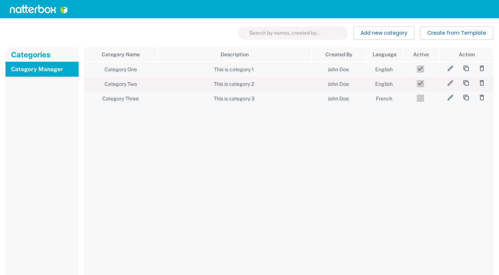

# Insight Categorisation

Insight is a voice analytics tool whose key benefits lie in its ability to highlight calls that are important to the
company using it and provide an imbedded training and feedback tool. To maximise the utility of Insight and ensure it is
a productive tool for our customers in the long term, it is important that our customers are able to accurately
programme Insight to identify the areas of a call that are of interest to them.

## General Information

Thanks to this project it will be possible for customers to create categories/dictionaries and then apply them to
users/groups.
Insight currently uses Voicebase’s categorisation engine. While the engine is comprehensive, it only works as long as we
use Voicebase as our transcription partner. Natterbox intends to use other transcription partners - the first being
Deepgram - and therefore needs to build an agnostic categorisation engine that will work with any transcription partners
we work with in the future.

The Natterbox implementation of the Voicebase engine means that customers are not able to create, update or delete
categories and dictionaries themselves. Instead, they need to ask Natterbox support to do this for them. In reality,
customers rarely update the tool after its initial configuration. This results in the Insight product getting out of
sync with the customer’s business needs, sit tops being useful and customers discontinue the product.

## Features

- Create/Edit Category
- Create Category from Template
- Category History ( in progress )
- Table with Categories
- Category View ( in progress )
- Create/Edit Dictionary ( in progress )
- Table with Dictionaries ( in progress )
- Dictionary History ( in progress )

## Tech Stack

- [React](https://reactjs.org/) - A JavaScript library for building user interfaces
- [Typescript](https://www.typescriptlang.org/) - TypeScript is JavaScript with syntax for types.
- [Redux Toolkit](https://redux-toolkit.js.org/) - Redux Toolkit is a set of tools that helps simplify Redux
  development.
- [SCSS](https://sass-lang.com/) [(BEM)](https://en.bem.info/methodology/) - Sass is the most mature, stable, and
  powerful professional grade CSS extension language in the world.
- [Stroybook](https://storybook.js.org/) - Storybook is a frontend workshop for building UI components and pages in
  isolation.
- [Loki](https://loki.js.org/) - Loki makes it easy to test your Storybook project for visual regressions.
- [Jest](https://jestjs.io/) - Jest is a delightful JavaScript Testing Framework with a focus on simplicity.
- [React Testing Library](https://testing-library.com/docs/react-testing-library/intro/) - The React Testing Library is
  a very light-weight solution for testing React components
- [Webpack](https://webpack.js.org/) - Webpack is a free and open-source module bundler for JavaScript. It is made
  primarily for JavaScript, but it can transform front-end assets such as HTML, CSS, and images if the corresponding
  loaders are included.
- [Eslint](https://eslint.org/) - ESLint statically analyzes your code to quickly find problems.
- [Prettier](https://prettier.io/) - An opinionated code formatter
- [Stylelint](https://stylelint.io/) - A mighty CSS linter that helps you avoid errors and enforce conventions.

## Installation

**To run the project you need the following tools:**

- **NodeJs** version 16+
- You must have **yarn** installed ( development is done using yarn, not npm )
- **Docker** ( to run **Loki** )

## Run Locally

1. Clone the project
2. Go to the project directory

    ```bash
    cd insight-category-ui
    ```

3. In case you don't have **yarn** installed, run the next command ( If you have yarn installed you can go to the next
   step ):
    ```bash
    npm install --global yarn 
    ```

4. Run the following command in the terminal to install the dependencies from package.json:

    ```bash
    yarn
    ```

5. Start the server

    ```bash
    yarn start
    ```

6. Since this project only runs inside a Visualforce page (there is no stanalone version) we'll need to configure
   additional settings.
    1. In the Salesforce organisation you are using, click **Setup** then select **Setup**
    2. In **Quick find** you have to search: **Visualforce Pages**
    3. Click on **Edit** to project **insightsConfiguration**
    4. You need to replace the line
       ```<script src="{!insightsReactHost}/main.js"></script>```
       with
       ```<script src="https://localhost:3000/main.js"></script>```
       and comment/remove the next line to use styles from the local project but not from the hosted project:
       ```<link href="{!insightsReactHost}/css/main.css" rel="stylesheet"></link>```
    5. These changes will affect the whole organisation

## Running Tests

### [Jest README](./config/jest/JEST.md)

### [Storybook README](./config/storybook/STORYBOOK.md)

### [Loki README](./.loki/LOKI.md)

## Feature-Sliced Design Architecture

Feature-Sliced Design is an architectural approach for structuring front-end projects, focused on organizing code around
features rather than following traditional structural patterns. This approach allows for better maintainability,
scalability, and modularity within a project. The following sections will provide information on each layer of the
Feature-Sliced Design architecture, including their purpose, the levels they may use, and the components they should
contain.

### Layers

#### 1. App Layer

The App layer is the top-level layer of the application and is responsible for managing the global configuration,
routing, and initial rendering of the application. It usually contains:

* Main application entry point
* Global configuration settings
* Route definitions
* High-level application layout

Inside this layer the following layers can be used: **pages**, **widgets**, **features**, **entities**, **shared**.

#### 2. Pages Layer

The Pages layer is responsible for composing features and entities into cohesive user interfaces. Pages act as the
primary entry points for users interacting with the application. Each page typically includes:

* Page-specific components
* Page-specific layouts
* Composition of features and entities

Inside this layer the following layers can be used: **widgets**, **features**, **entities**, **shared**.

### 3. Widgets Layer

The Widgets layer is dedicated to smaller, self-contained components that can be embedded within features or pages.
Widgets often encapsulate complex functionality or integrations, providing a simplified interface for consumption.
Examples of widgets may include:

* Interactive visualizations
* Third-party integrations (e.g., maps, social media feeds)
* Self-contained UI components (e.g., date pickers, autocomplete inputs)

Inside this layer the following layers can be used: **features**, **entities**, **shared**.

#### 4. Features Layer

The Features layer consists of self-contained units of functionality that can be combined to create the overall
application experience. Each feature is organized around a specific domain or user-facing functionality. Features may
include:

* Local state management
* Feature-specific components and layouts
* Feature-specific logic and data handling
* Feature-specific API integrations

Inside this layer the following layers can be used: **entities**, **shared**.

#### 5. Entities Layer

The Entities layer is responsible for managing the application's data structures and business logic. This includes:

* Data models and schemas (e.g., Category, Template, User)
* API integrations
* Business logic (e.g., validation, transformations)
* Services (e.g., data fetching, state management)

Inside this layer the following layers can be used: **entities**, **shared**.

#### 6. Shared Layer

The Shared layer contains reusable components, utilities, and configurations that are used across multiple features or
other layers of the application. This layer may include:

* UI components (e.g., buttons, form elements)
* Utility functions and libraries
* Shared configuration settings
* Shared services (e.g., authentication, localization)

Inside this layer the following layers can be used: **shared**,

## Color Reference

| Color                     | Hex                                                                |
|---------------------------|--------------------------------------------------------------------|
| white                     |  `#fff`       |
| natterbox-aqua            |  `#64ccc9` |
| turquoise-blue            |  `#00a9ce` |
| sf-brand-blue             |  `#0b5cab` |
| natterbox-char-fourth-col |  `#dee1e2` |
| grey-1                    |  `#999`          |
| grey-2                    |  `#f8f8f8` |
| grey-3                    |  `#f4f2f2` |
| grey-4                    |  `#eaeaea` |
| pinkish-grey              |  `#ccc`          |
| pinkish-grey-two          |  `#bfbfbf` |
| natterbox-grey            |  `#5c6770` |
| natterbox-dark-blue-grey  |  `#49535c` |
| input-text-colour         |  `#999`          |
| silver                    |  `#bec2c6` |
| sick-green                |  `#b8c62a` |
| natterbox-green           |  `#c2d210` |
| sun-yellow                |  `#ffc72e` |
| natterbox-orange          |  `#dd8340` |
| green                     |  `#2e844a` |
| jungle-green              |  `#04844b` |
| natterbox-magenta         |  `#b4458d` |
| natterbox-lighter-red     |  `#f8485e` |
| natterbox-red             |  `#eb0c28` |
| black                     |  `#000`          |

## Screenshots



## Documentation

[Wireframe](https://app.diagrams.net/?src=about#G193hsM88CXD0PlXvJaNHw2BmlLBLEdN76)

[Permissions](https://app.diagrams.net/#G1J4MkuNsuX55S_p6BkeTJtuvt6hWugIRO)

[Design](https://scene.zeplin.io/project/616e7b463ebd191287ca0aef)

[Category Logic](https://natterbox.atlassian.net/wiki/spaces/I1P/pages/1080918017/Category+Logic)

[Insight 1.5 category and dictionary engine requirements](https://natterbox.atlassian.net/wiki/spaces/I1P/pages/1039925349/Insight+1.5+category+and+dictionary+engine+requirements)

